```{r setup, include=FALSE}
knitr::opts_chunk$set(echo = TRUE)
#Loading Required Packages
library(caret)
library(knitr)

# Setup
data(ToothGrowth)
head(ToothGrowth)
TG<-ToothGrowth

# Storing in .csv file
write.csv(TG, file = "TG.csv")

# Freeing up memory
remove(ToothGrowth)

# Creating Description Object
desc<-data.frame(c("len","supp","dose"),c("numeric","factor","numeric"),c("Tooth Length","Supplement type (VC or OJ)","Dose in milligrams per day"))
```

## Soltuions:
  
  For the purpose of this assignment I chose the `ToothGrowth` dataset from base R. The description of the dataset is as follows:
  
```{r,warning=FALSE,message=FALSE,echo=FALSE}
kable(desc, format="pandoc", col.names = c("Variable Name","Type","Description"))
```
  
  
* __First, build a decision tree using Rattle just as we did here on a data set of your choosing.__  
  + Take several screen shots of your work and paste into a MS Word, LibreOffice, of pdf file, explain each step
  + Tell me what you learned from the decision tree  
  
  We build the decision tree using rattle as follows:  
  
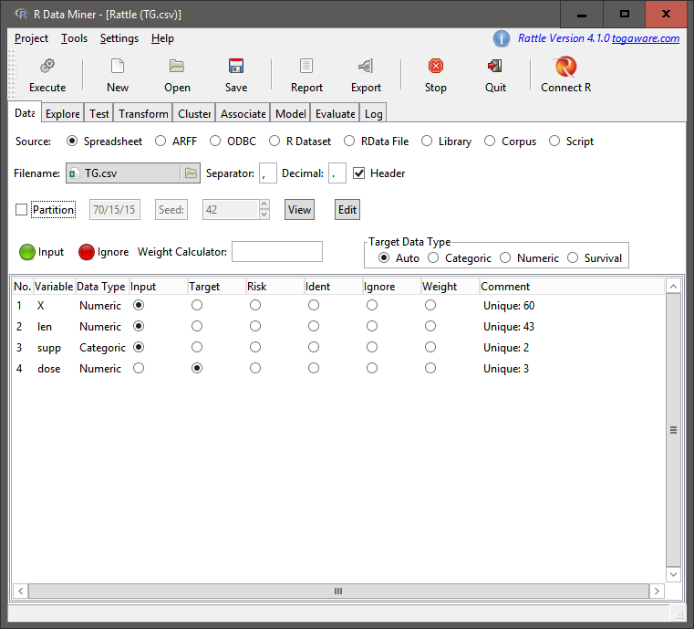  
  
  The above screen shot shows the initial screen after laoding the dataset and then selecting the response variable as `dose`.  
  
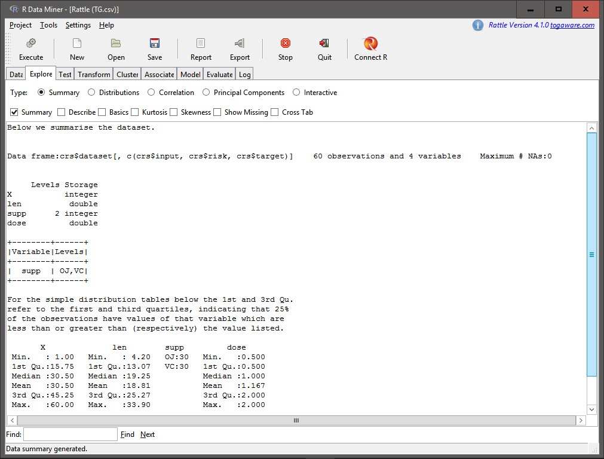  
  
  In order to get a better idea about the data we perform a summary on the data as shown above.  
  We then observe the correlation between varaibles as follows:  
  
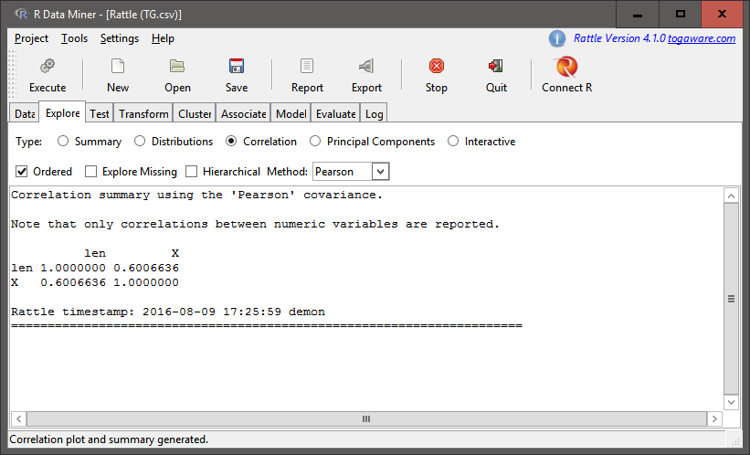
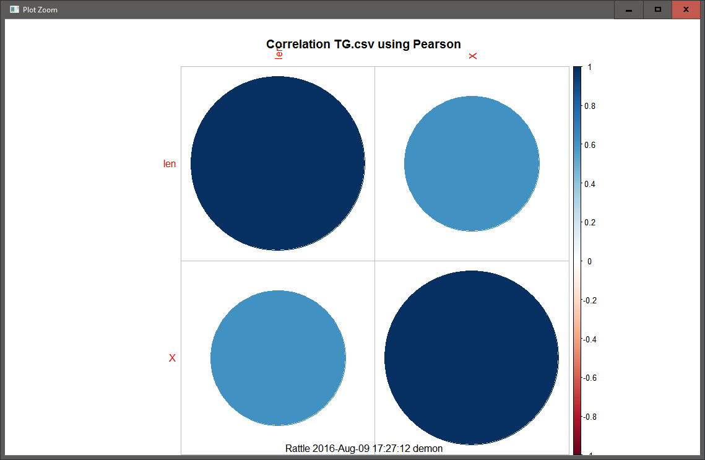  
  
  The above correlation matrix helps us get a better idea about how the variables are correlated. The correlation plot which comes out in the main RStudio plots tab gives us a visual perspective.  
  While not necessary to be done in rattle, an additional step which I took was to perform principal component analysis on the data (while exploring the functions of rattle) as follows:  
  
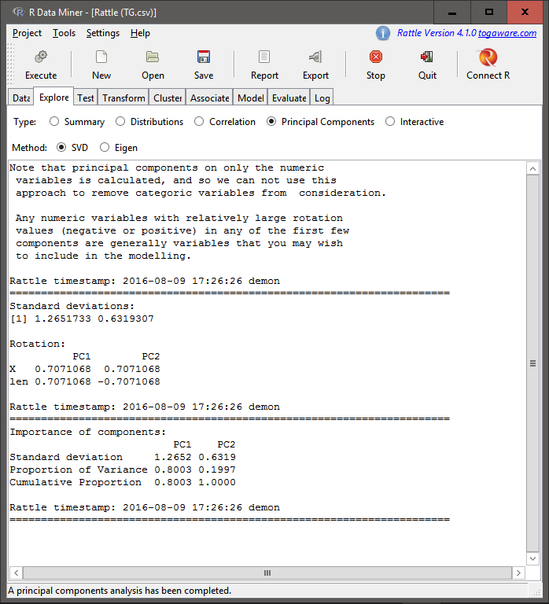
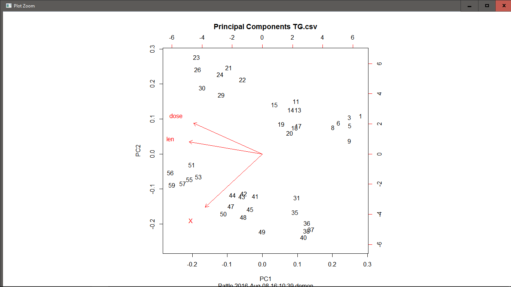  
  
  The analysis and the plot helps us see that the `len` covariate can explain around 70% of the data.  
  We now begin to construct the decision trees through the model tab of rattle as follows(without setting the Loss Matrix):  
  
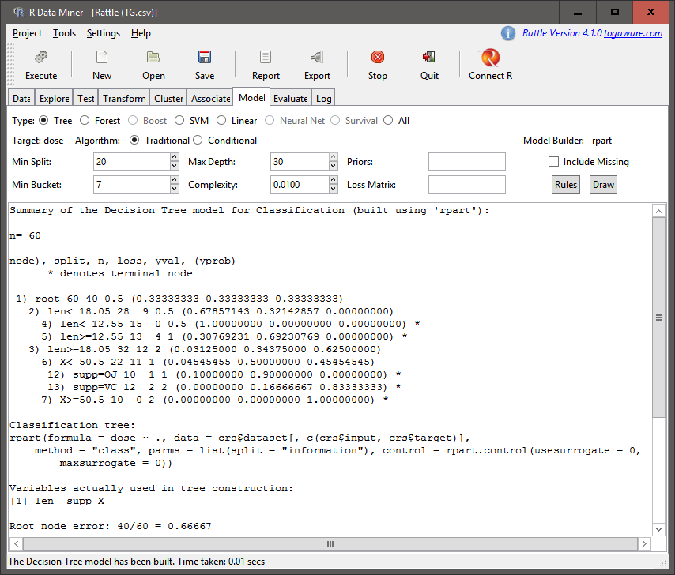
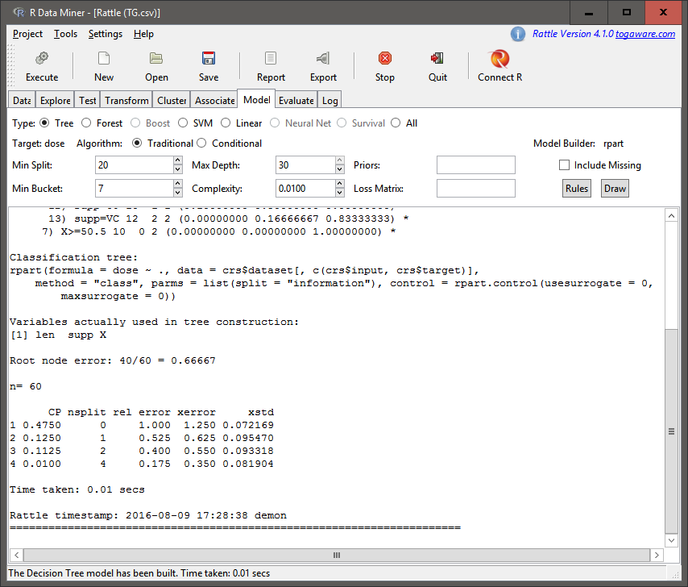  
  
  As we can see from the above output, at node 1, there are 60 rows of data with 40 classified wrongly and the decision at this point is 0.5. At node 2 we further split the data based on `len` being less than 18.05, such that this node has 28 rows with 9 classified wrongly. Further nodes of 4 and 5 split based on the condition of `len` being less than or greater than(or equal to) 12.55 such that in node 4 none are classified wrongly while at node 5 4 are classified wrongly with a dose of 1.  
  At node 3 (when `len` is greater than or equal to 18.05) we see that there are 32 rows such that 12 are wrongly classified as 2. the next split takes place over the intercept (represented by X, which is the intercept on the x axis) being less than or greater than (or equal to) 50.5 such that at node 6 there are 22 rows with 11 wrongly classified as 1 and at node 7 there are 10 rows out which all are classfied as 2. Further splitting takes place after node 6 to give node 12 with `supp`=OJ with 10 rows such that 1 is wrongly classified as 1 and node 13 with `supp`=VC with 12 rows such that 2 are wrongly classified as 2.  
  We can further draw the tree diagram using the 'draw' button to obtain it under the plot tab in RStudio as follows:
  
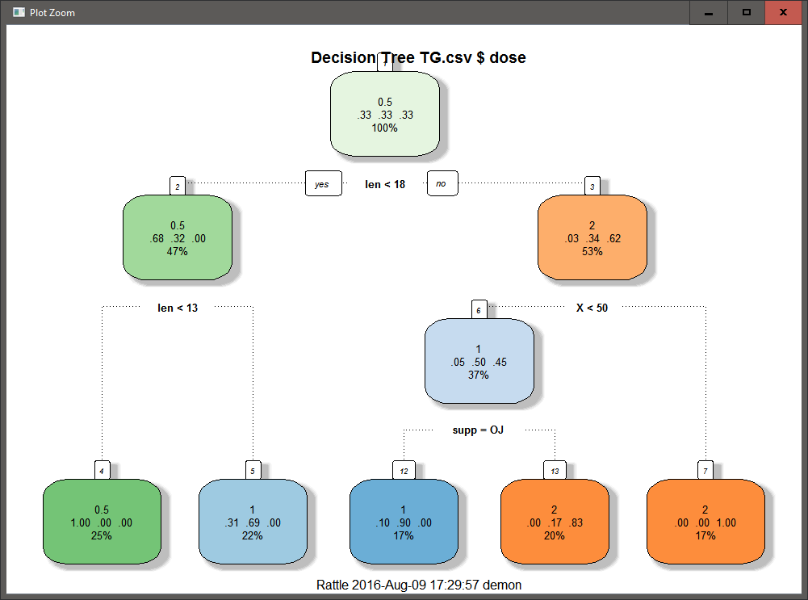  

  We now rebuild the decision tree with the Loss Matrix as follows:  

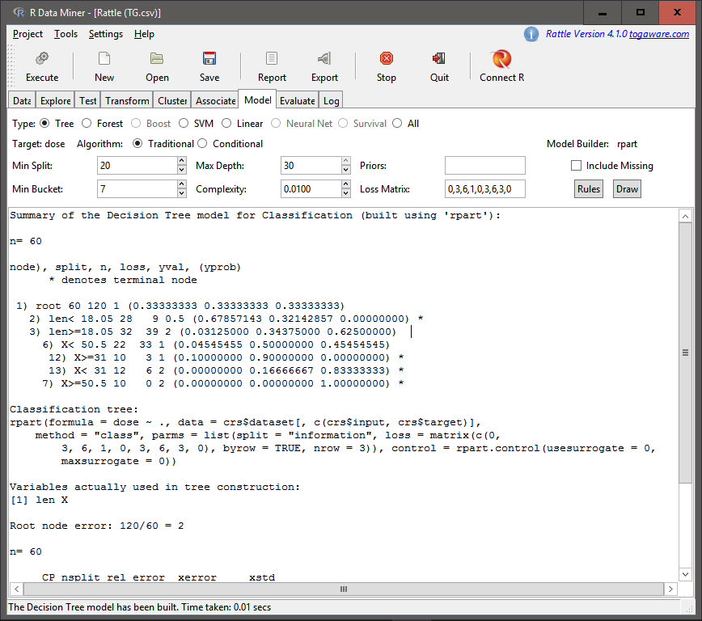
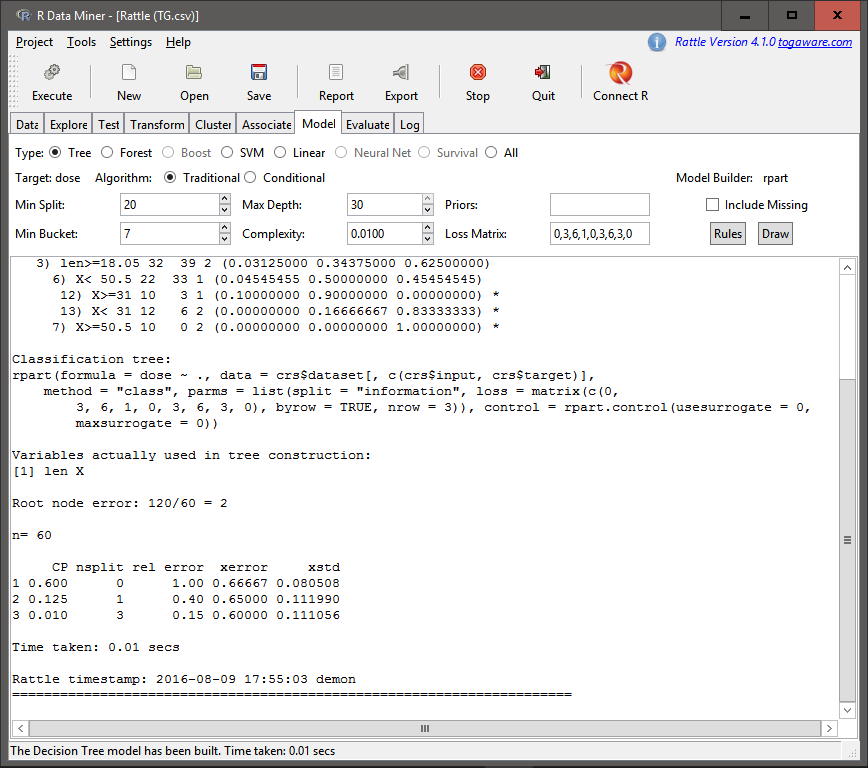
  
  Here we see that the only difference with the previous decision tree is that the nodes 12 and 13 are now split on the X intercept of 31, as well the distribution of the rows and the observations wrongly classified. We draw the decision tree as follows:  
  
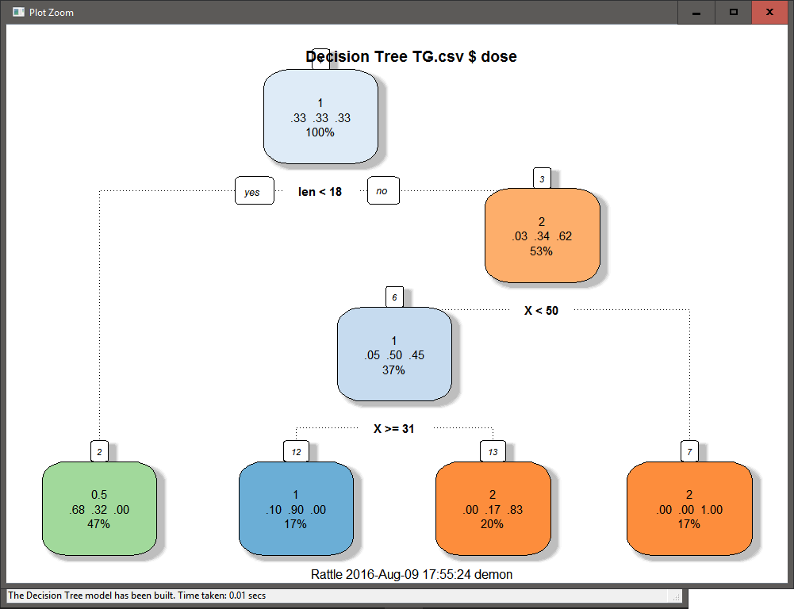  
  
  However, the above decision tree (in my opinion) is not as ggood as the previous one due to the amount of observations wrongly classified, especially in the case of the nodes 12 and 13. However, it does try to take into account the effects fo wrongly classifying higher doses of medicine.

* __Build another model of your choice using Rattle on the same data set__  
  + You can run Association Analysis, PCA, Regression, .whatever
  + Tell me what you learned from this analysis and from the decision tree combined  
  
  For the purpose of the second part of this assignment I chose to perform a regression analysis on the dataset I chose. Following are the steps taken for the purpose of the analysis:  
  
```{r,warning=FALSE,message=FALSE}
# Setting Seed for reproducible research
set.seed(695949)

# Creating correlation matrix
TG_cor<-cor(data.matrix(TG))
TG_cor
```  
  
  The above correlation matrix shows us that there is a strong positive correlation between `len` and `dose` variables and also a lesser negative correlation between `supp` and `len` variables. We hence try to find the linear combos to see if we should possibly remove `supp` from the linear regression model.  
  
```{r,warning=FALSE,message=FALSE}
#Checking which variables can be removed
findLinearCombos(data.matrix(TG))
```  
  
  The `findLinearCombos()` function did not throw out `supp` variable from the model (though this might be because we converted the entire data frame into a numeric matrix). We now begin to partition the data as follows:  
  
```{r,warning=FALSE,message=FALSE}
# Creating Training and Test Data partitions
TG_sv<-createDataPartition(TG$dose, p=.75,list=FALSE)
TG_train<-TG[TG_sv,]
TG_test<-TG[-TG_sv,]
```  
  
  We build the model as follows(we consider the interaction between `len` and `supp` as the correlation was significant enough to be considered initially and we can also verify the need to include the interaction in the following part):  
  
```{r,warning=FALSE,message=FALSE}
# Creating the linear model
TG_lm1<-lm(dose~len+supp+len*supp, data = TG)

# Details of the linear model
summary(TG_lm1)
```  
  
  The summary statistics tells us that we do not need to take into account the interaction between `supp` and `len` and so we rebuild the model as follows:  
  
```{r,warning=FALSE,message=FALSE}
# Rebuilding the model
TG_lm2<-lm(dose~len+supp, data = TG)

# Details of the new model
summary(TG_lm2)
```  
  
  As seen from the summary statistics, we do not need to remove any varaibales and should confirm usign the `anova()` function as follows:  
  
```{r,warning=FALSE,message=FALSE}
# Performing anova
anova(TG_lm2,TG_lm1)
```  
  
  As seen from the anova table, by removing the interaction between `supp` and `len`, we have created a model with fewer degress of freedom that can be considered as a better fit. We now move on to predicting the values and comparing with the data as follows:  
  
```{r,warning=FALSE,message=FALSE}
# Predicting the with the test dataset
TG_p<-predict(TG_lm2, TG_test)

# Observing the results
summary(TG$dose)
summary(TG_train$dose)
summary(TG_test$dose)
summary(TG_p)
```  
  
  The above summaries tells us a few things about the model. While the model is not as accurate, the difference between actual and predicted values seems to be small enough to be considered as a good model. Additionally, further training of the model through a larger dataset may be required for the residuals to be minimized.  
  
* __Tell me why you prefer RStudio over Rattle or the opposite or some other tool of your choice over Rstudio.  Just looking for opinions here, but I am curious HOW you evaluate the different tools.__   
  
  I prefer RStudio over rattle mostly because of the flexibility of the commands and the understanding I can obtain through the documentation. This may be due to my background in computer science, but I like to have the ability to know about the finer details of the functions being executed and having the ability to pass parameters to modify the output as I need. Again, this may be because I am just used to looking through code. That being said, I do find Rattle to be a useful tool to obtain quick results. However, for me, it would be something I would use to get get brief overviews of the data and perform quick analysis before trying to get down to the actual construction of models or graphics.  
  
