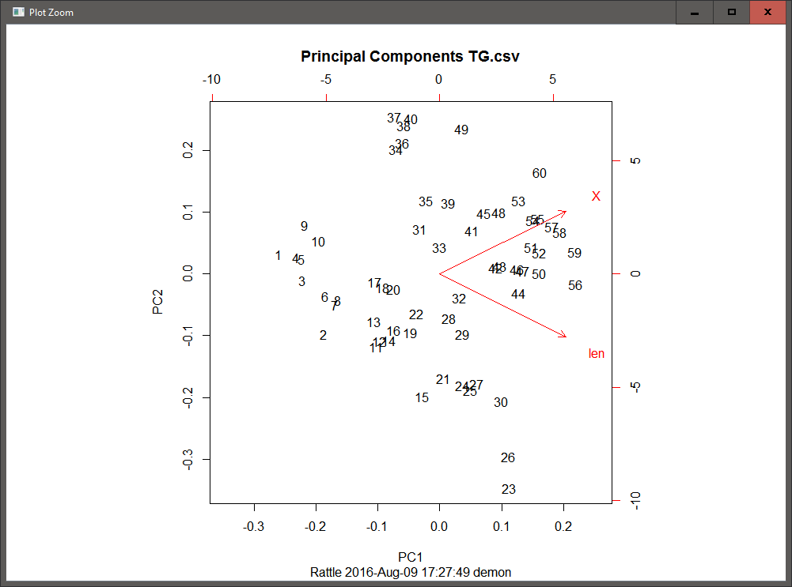

```{r setup, include=FALSE}
knitr::opts_chunk$set(echo = TRUE)
#Loading Required Packages
library(caret)

# Setup
data(ToothGrowth)
head(ToothGrowth)
TG<-ToothGrowth

# Storing in .csv file
write.csv(TG, file = "TG.csv")

# Freeing up memory
remove(ToothGrowth)

# Creating Description Object
desc<-data.frame(c("len","supp","dose"),c("numeric","factor","numeric"),c("Tooth Length","Supplement type (VC or OJ)","Dose in milligrams per day"))
```

## Soltuions:
  
  For the purpose of this assignment I chose the `ToothGrowth` dataset from base R. The description of the dataset is as follows:

* __First, build a decision tree using Rattle just as we did here on a data set of your choosing.__  
  + Take several screen shots of your work and paste into a MS Word, LibreOffice, of pdf file, explain each step
  + Tell me what you learned from the decision tree  




* __Build another model of your choice using Rattle on the same data set__  
  + You can run Association Analysis, PCA, Regression, .whatever
  + Tell me what you learned from this analysis and from the decision tree combined


```{r,warning=FALSE,message=FALSE}
# Setting Seed for reproducible research
set.seed(695949)

# Creating correlation matrix
TG_cor<-cor(data.matrix(TG))
TG_cor

#Checking which variables can be removed
findLinearCombos(data.matrix(TG))

# Creating Training and Test Data partitions
TG_sv<-createDataPartition(TG$supp, p=.75,list=FALSE)
TG_train<-TG[TG_sv,]
TG_test<-TG[-TG_sv,]

# Creating the linear model
TG_lm1<-lm(as.numeric(supp)~len+dose+len*dose, data = TG)

# Details of the linear model
summary(TG_lm1)

# Rebuilding the model
TG_lm2<-lm(as.numeric(supp)~len, data = TG)

# Details of the new model
summary(TG_lm2)

# Performing anova
anova(TG_lm2,TG_lm1)

# Predicting the with the test dataset
TG_p<-predict(TG_lm2, TG_test)

# Observing the results
summary(as.numeric(TG$supp))
summary(as.numeric(TG_train$supp))
summary(as.numeric(TG_test$supp))
summary(TG_p)
```

* __Tell me why you prefer RStudio over Rattle or the opposite or some other tool of your choice over Rstudio.  Just looking for opinions here, but I am curious HOW you evaluate the different tools.__   

